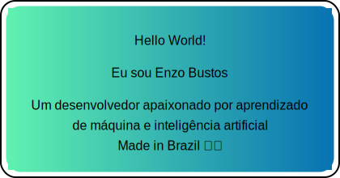

<h1 align="center"> 🪚 Em Construção ⚙️ </h1>

<!-- Contador de Visitantes -->

    
    

<!-- Banner Image -->

    

 Hello World! 

<h1 align="center" style="font-size:xx-large; font-weight:bold;"> Eu sou Enzo Bustos </h1>

 Um desenvolvedor apaixonado por aprendizado de máquina e inteligência artificial 

 Made in Brazil 🇧🇷 

<!-- Sobre Mim -->
# 🙋‍♂ Sobre Mim
- 🔭 Atualmente estou trabalhando em **[Nome do Projeto]**
- 🌱 Atualmente estou aprendendo **[Tecnologia ou Habilidade]**
- 👯 Estou procurando colaborar em **[Tipo de Projetos]**
- 🤝 Estou procurando ajuda com **[Problemas ou Projetos Específicos]**
- 💬 Pergunte-me sobre **[Tópico de Interesse]**
- 📫 Como me contatar **[seu-email]@example.com**
- 📄 Saiba mais sobre minhas experiências [CV or Portfolio](https://your-cv-or-portfolio-link.com)
- ⚡ Curiosidade **[Fato Interessante]**

<!-- Linguagens e Ferramentas -->
# 🛠 Linguagens e Ferramentas

<!-- Adicione suas linguagens e ferramentas aqui -->

<!-- Projetos -->
# 🔭 Projetos
- [Nome do Projeto 1](https://link-do-projeto.com) - Descrição curta do projeto.
- [Nome do Projeto 2](https://link-do-projeto.com) - Descrição curta do projeto.
<!-- Adicione seus projetos aqui -->

<!-- Estatísticas do GitHub -->
# 📊 Estatísticas

<!-- Contribuições e Atividades -->
<!-- https://github.com/Ashutosh00710/github-readme-activity-graph?tab=readme-ov-file#common-options -->
# ⚙ Contribuições e Atividades

<!-- Redes Sociais -->
# 🌐 Contato

# Skills

# Aprendendo

# Setup

<!-- Seção de Recados -->
# 📬 Recados
<!-- ISSUES:START -->
- [Recado 1](https://link-para-issue) - @usuário
- [Recado 2](https://link-para-issue) - @usuário
<!-- ISSUES:END -->